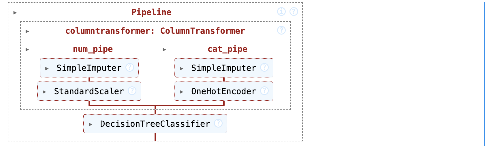

# Supervised ML: classification and regression models of housing data.

## Project Overview
This project aims to build classification and regression models for housing data using supervised machine learning techniques.

## Project's Folder Structure

This project is organized into three folders, each serving a specific purpose. Below is the structure and description of these directories:

- `/house-prices-data`: This directory contains all CSV tables which have been used for the project.

- `/plots`: This directory houses all the plots generated as part of this project.

- `/notebooks`: This directory houses all model calculations, including data preprocessing, model training, parameter tuning, and evaluation metrics. 
 

## Dataset
The housing dataset used in this project contains various features such as the number of rooms, the age of the house, and the median value of owner-occupied homes. The target variable is the median value of owner-occupied homes.

## Approach
The project will follow the following steps:
1. Data preprocessing: This step involves handling missing values, feature scaling, and encoding categorical variables if necessary.
2. Exploratory data analysis: This step includes visualizing the data, analyzing the distribution of the target variable, and identifying any correlations between features.
3. Model selection: Different classification and regression models will be evaluated, such as logistic regression, decision trees, random forests, and support vector machines. The models will be trained and evaluated using appropriate performance metrics.
4. Model tuning: The selected models will be fine-tuned using techniques like grid search or random search to optimize their hyperparameters.
5. Model evaluation: The final models will be evaluated on a separate test set to assess their performance and compare them based on relevant metrics.

## Classification of Housing Dataset

In this section of the project, I aim to classify houses into two categories based on their price: "Expensive" (labeled as 1) and "Not Expensive" (labeled as 0). This classification helps in understanding the affordability and market segmentation of houses in the dataset.

### Methodology
To achieve this, I employ a Decision Tree Classifier, a machine learning algorithm that iteratively splits the dataset into smaller groups based on certain criteria to arrive at a decision (in this case, the housing price category). The decision tree is built by:

1. Selecting the best feature to split on that results in the most informative separation of the houses into the two price categories.
2. Repeating the process for each derived subset until the tree fully classifies all instances or meets a stopping criterion to prevent overfitting.

### Data Preprocessing

Before feeding the data into the model, we perform several preprocessing steps:
- **Feature Selection**: I identify and select the most relevant features that influence house pricing, such as location, size, number of bedrooms, and amenities.
- **Data Cleaning**: Handling missing values by imputation or removal, and removing outliers that could skew our model's performance.
- **Feature Engineering**: Creating new features that might better capture the complexities of house prices.
- **Encoding and Scaling**: Converting categorical data into numerical values and scaling all features to ensure fair weightage is given to each during model training.

### Model Training and Evaluation

The Decision Tree Classifier is trained using a subset of the dataset reserved for training. We evaluate its performance on a separate testing set to ensure our model generalizes well to unseen data. Performance metrics such as accuracy, precision, recall, and the F1-score are used to gauge the model's effectiveness in classifying the houses accurately.

## Regression of Housing Dataset

The idea of this project is to predict the sales price for each house. For each house Id in the test set, one needs to predict the value of the SalePrice variable.

### Evaluation Metric

Submissions are evaluated on Root-Mean-Squared-Error (RMSE) between the logarithm of the predicted value and the logarithm of the observed sales price.

### Final Result

The final result of the classification model using the Random Forest algorithm is 0.16. All detailed calculation you can find in the notebooks. 

